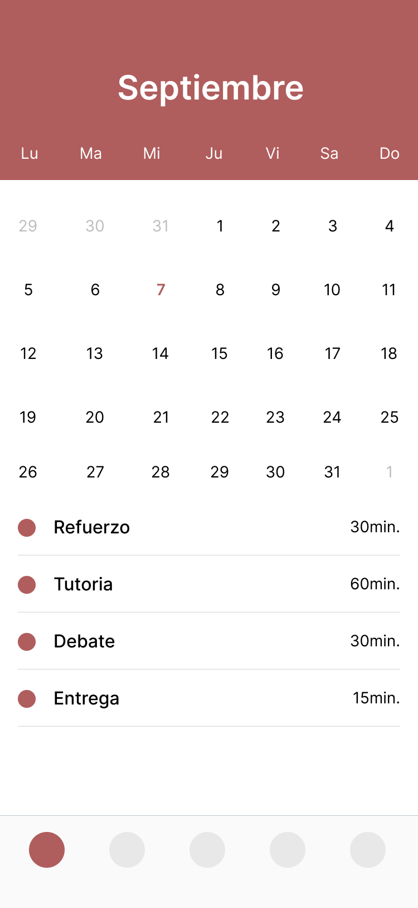

# Diseño de interfaz de usuario

La interfaz de usuario de la aplicación EduNinja esta inspirada en la interfaz de usuario de
aplicaciones similares y en el uso de [Material Design](https://material.io/design).

El diseño completo esta disponible
en [Figma](https://www.figma.com/proto/QVN5dL34l3cHJg9AqcT2DT/EduNinja?type=design&node-id=144-682&t=1lLXvl7nNwEwxJCh-1&scaling=scale-down&page-id=0%3A1&mode=design)
. Los colores a usar estaran basados en una combinación de escalas de rojo. A continuación se
presentan las principales pantallas:

1. Inicio de sesión

   Cuando los usuarios ingresen a la aplicación veran el sistema de autenticación de la aplicación.

   

2. Tienda de servicios de la aplicación

   El usuario vera el listado de actividades disponibles para contratar.

   

3. Chat

   Podra ver el chat en vivo de la actividad adquirido con otro usuario.

   

4. Perfil de usuario
   El usuario podra ver la información relevante de su perfil

   

5. Calendario de actividades

   Aqui podra ver las actividades que deben ser entregadas o que estan a la espera por ser enviadas por otro usuario.

   